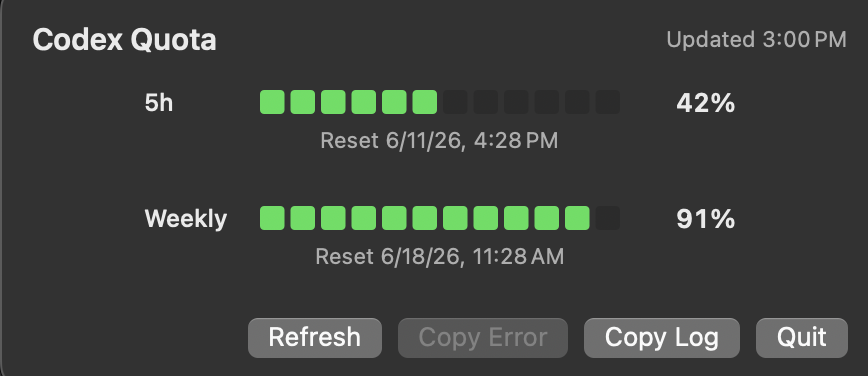

# QuotasWatcher

[简体中文](README.zh-Hans.md)

A tiny macOS utility for watching your Codex quota from the Touch Bar or menu bar.

If you are still using a MacBook with a Touch Bar, QuotasWatcher shows your remaining Codex quota there. On Macs without a Touch Bar, it falls back to the menu bar.

Open it, watch the next 5-hour quota window, and start being anxious productively.

Claude Code support: no. I do not like Anthropic, so if you need that version, go vibe it yourself.

## Screenshots




## Install from Release

1. Download the latest `QuotasWatcher-*-macos.zip` from [GitHub Releases](https://github.com/ezraluuu-lhk/QuotasWatcher/releases).
2. Unzip it and move `QuotasWatcher.app` to `/Applications` if you want.
3. Open `QuotasWatcher.app`, then look for `Codex --%` or `Codex NN%` in the macOS menu bar.

The app is not signed or notarized yet. If macOS blocks the first launch, right-click `QuotasWatcher.app`, choose `Open`, then confirm once.

## Build

```bash
swift test
Scripts/check-localizations.sh
swift build -c release
Scripts/package-app.sh
```

The packaged app is written to:

```text
dist/QuotasWatcher.app
```

Open the `.app` bundle itself from Finder, or run:

```bash
open dist/QuotasWatcher.app
```

Do not open `dist/QuotasWatcher.app/Contents/MacOS/QuotasWatcher` directly. That is the internal Unix executable; Finder will launch Terminal and show a line like `.../Contents/MacOS/QuotasWatcher ; exit;`.

## Requirements

- macOS 13 or newer.
- Codex CLI/app-server installed and authenticated.
- QuotasWatcher starts Codex with:

```bash
codex app-server --listen stdio://
```

Binary lookup order:

1. `/Applications/Codex.app/Contents/Resources/codex`
2. `/usr/local/bin/codex`
3. `/opt/homebrew/bin/codex`
4. `codex` from `PATH`

## Behavior

The menu bar item shows the 5-hour quota remaining percentage. If Codex does not return a 5-hour window, it falls back to weekly usage, marks the menu bar value with `W`, and shows an explanatory banner in the popover. The popover shows two segmented battery rows:

- `5h`
- `Weekly`

Each row displays remaining percentage and reset time. When Codex reports banked rate-limit resets, the popover header also shows how many are available; resets must still be redeemed in Codex itself. Remaining quota is calculated as `100 - usedPercent`. Refreshes keep the previous data visible until a new valid response arrives. The app refreshes every 5 minutes and also provides manual refresh plus quit actions.

After launch, look for `Codex --%` or `Codex NN%` in the macOS menu bar near the clock. Click it to open the quota popover. Right-click it for refresh and quit actions.

Touch Bar content is contextual: click the menu bar item to open the QuotasWatcher popover and make the app active. The Touch Bar mirrors the same two quota rows when macOS exposes a physical Touch Bar for the active app.

The popover and right-click menu include `Copy Error` and `Open Log` actions for troubleshooting. Logs are written to:

```text
~/Library/Application Support/QuotasWatcher/QuotasWatcher.log
```

## Bark Notifications

QuotasWatcher can send quota-reset notifications to an iPhone through [Bark](https://github.com/Finb/Bark). Open `Bark…` from the popover or right-click menu, enter the device key or its `https://api.day.app/<key>/` URL, and use `Test Connection` to verify delivery.

Notification types can be enabled independently:

- Scheduled 5-hour resets
- Scheduled weekly resets
- Other/free resets, detected when remaining quota rises by at least 10 percentage points and the reset date advances before the scheduled reset
- Reset-bank increases, detected when the number of available banked resets rises

The Bark key is stored locally in macOS app preferences. QuotasWatcher never writes the key or complete push URL to its log. Scheduled-reset comparisons use a 30-minute observation window. Strong other/free-reset evidence remains eligible across gaps up to 6 hours, which covers ordinary sleep and network interruptions without reporting resets after a long shutdown. Reset-bank increases use the explicit bank count and can still be reported after a longer observation gap.

## Localization

QuotasWatcher uses native macOS `.lproj` localization files:

```text
Sources/QuotasWatcher/Resources/en.lproj/Localizable.strings
Sources/QuotasWatcher/Resources/zh-Hans.lproj/Localizable.strings
```

Run this before opening a pull request:

```bash
Scripts/check-localizations.sh
```

The packaging script copies these `.lproj` directories into `dist/QuotasWatcher.app/Contents/Resources`.

## License

MIT. See [LICENSE](LICENSE).

## Troubleshooting

- `Codex binary was not found.`: install Codex or make sure `codex` is available in one of the lookup paths above.
- `Not initialized`: the app-server requires JSON-RPC `initialize` before `account/rateLimits/read`; QuotasWatcher sends this automatically. If this appears, update Codex and restart the app.
- `failed to fetch codex rate limits`: Codex app-server could not reach the ChatGPT backend or is not authenticated. Check network access and run Codex once interactively to confirm login.
- No Touch Bar content: click the QuotasWatcher menu bar item first so its popover is active. Touch Bar support also depends on hardware and macOS Touch Bar availability; Macs without a physical Touch Bar will not show it.
