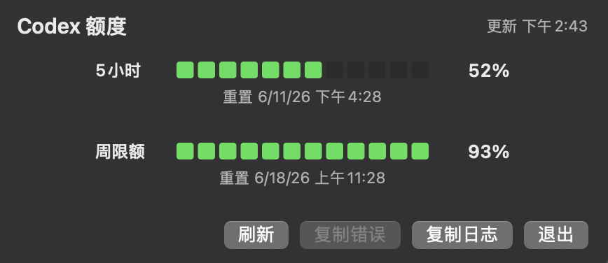

# QuotasWatcher

[English](README.md)

一个支持 Touch Bar 显示的 Codex 用量工具。

灵感来自小红书上看到的一段 Prompt。后来想回去找原作者，但没找到。要是你刷到了，DM 我，我给你补到致谢里。

原始 Prompt：
```
用 Swift/AppKit 做成 macOS 菜单栏 + Touch Bar 小应用。额度不抓网页，而是调用本机 Codex 的 app-server：启动 /Applications/Codex.app/Contents/Resources/codex app-server --listen stdio://，通过 JSON-RPC 请求  account/rateLimits/read ，拿到 5 小时额度、周额度、已用百分比和重置时间。剩余额度用 100 - usedPercent 计算。界面做成两行分段电量条：5小时、周限额，右侧显示剩余百分比和重置时间。刷新时新数据回来再替换旧数据
```

## 截图




## 从 Release 安装

1. 从 [GitHub Releases](https://github.com/ezraluuu-lhk/QuotasWatcher/releases) 下载最新的 `QuotasWatcher-*-macos.zip`。
2. 解压后可以把 `QuotasWatcher.app` 移动到 `/Applications`。
3. 打开 `QuotasWatcher.app`，然后在 macOS 菜单栏里找 `Codex --%` 或 `Codex NN%`。

当前 app 还没有签名和公证。如果 macOS 阻止首次启动，右键点击 `QuotasWatcher.app`，选择 `打开`，再确认一次。

## 构建

```bash
swift test
Scripts/check-localizations.sh
swift build -c release
Scripts/package-app.sh
```

打包后的 app 会生成在：

```text
dist/QuotasWatcher.app
```

从 Finder 打开整个 `.app`，或者运行：

```bash
open dist/QuotasWatcher.app
```

不要直接打开 `dist/QuotasWatcher.app/Contents/MacOS/QuotasWatcher`。那是 app 内部的 Unix 可执行文件；Finder 会打开 Terminal，并显示类似 `.../Contents/MacOS/QuotasWatcher ; exit;` 的内容。

## 需求

- macOS 13 或更高版本。
- 已安装并登录 Codex CLI/app-server。
- QuotasWatcher 会这样启动 Codex：

```bash
codex app-server --listen stdio://
```

二进制查找顺序：

1. `/Applications/Codex.app/Contents/Resources/codex`
2. `/usr/local/bin/codex`
3. `/opt/homebrew/bin/codex`
4. `PATH` 里的 `codex`

## 行为

菜单栏项目会显示 5 小时额度剩余百分比。如果 Codex 没有返回 5 小时额度窗口，菜单栏会改为显示周额度并添加“周”标记，同时在弹窗中显示说明横幅。弹窗里有两行分段电量条：

- `5小时`
- `周限额`

每行显示剩余百分比和重置时间。当 Codex 返回已存额度重置次数时，弹窗标题栏也会显示当前可用数量；重置操作仍需在 Codex 中由用户自行完成。剩余额度按 `100 - usedPercent` 计算。刷新时会保留旧数据，直到新数据成功返回后再替换。应用每 5 分钟自动刷新一次，也提供手动刷新和退出操作。

启动后，在 macOS 菜单栏靠近时钟的位置找 `Codex --%` 或 `Codex NN%`。点击它可以打开额度弹窗；右键可以刷新或退出。

Touch Bar 内容是上下文相关的：先点击 QuotasWatcher 菜单栏项目，让弹窗成为当前活动 app。macOS 为当前 app 显示物理 Touch Bar 时，Touch Bar 会同步显示两行额度。

弹窗和右键菜单里有 `复制错误` 和 `打开日志`，方便排查问题。日志写入：

```text
~/Library/Application Support/QuotasWatcher/QuotasWatcher.log
```

## Bark 通知

QuotasWatcher 可以通过 [Bark](https://github.com/Finb/Bark) 把额度重置通知发送到 iPhone。在弹窗或右键菜单中打开 `Bark…`，输入设备密钥或 `https://api.day.app/<密钥>/` 链接，再用 `测试连接` 验证推送。

以下通知可以分别启用：

- 5 小时额度定时重置
- 周额度定时重置
- 其他/赠送额度重置：在预定重置前，剩余额度增加至少 10 个百分点且重置时间向后推进时检测
- 重置次数增加：可用的已存重置次数上升时检测

Bark 密钥仅保存在 macOS 应用偏好设置中。QuotasWatcher 不会把密钥或完整推送链接写入日志。定时重置使用 30 分钟的观测窗口；对于证据充分的其他/赠送额度重置，观测间隔放宽至 6 小时，以覆盖正常的睡眠和网络中断，同时避免应用长时间关闭后发送过期通知。重置次数增加使用明确的可用数量，因此即使两次观察间隔更长也可以发送通知。

## 本地化

QuotasWatcher 使用 macOS 原生 `.lproj` 本地化文件：

```text
Sources/QuotasWatcher/Resources/en.lproj/Localizable.strings
Sources/QuotasWatcher/Resources/zh-Hans.lproj/Localizable.strings
```

提交 PR 前运行：

```bash
Scripts/check-localizations.sh
```

打包脚本会把这些 `.lproj` 目录复制到 `dist/QuotasWatcher.app/Contents/Resources`。

## 许可证

MIT。见 [LICENSE](LICENSE)。

## 故障排查

- `Codex binary was not found.`：安装 Codex，或者确认 `codex` 在上面的查找路径中。
- `Not initialized`：app-server 要求先发送 JSON-RPC `initialize`，再调用 `account/rateLimits/read`；QuotasWatcher 会自动发送。如果出现这个错误，更新 Codex 并重启 app。
- `failed to fetch codex rate limits`：Codex app-server 无法访问 ChatGPT 后端，或当前未登录。检查网络，并先交互式运行一次 Codex 确认登录状态。
- Touch Bar 没有内容：先点击 QuotasWatcher 菜单栏项目，让弹窗处于活动状态。Touch Bar 也依赖硬件和 macOS 的 Touch Bar 可用性；没有物理 Touch Bar 的 Mac 不会显示。
